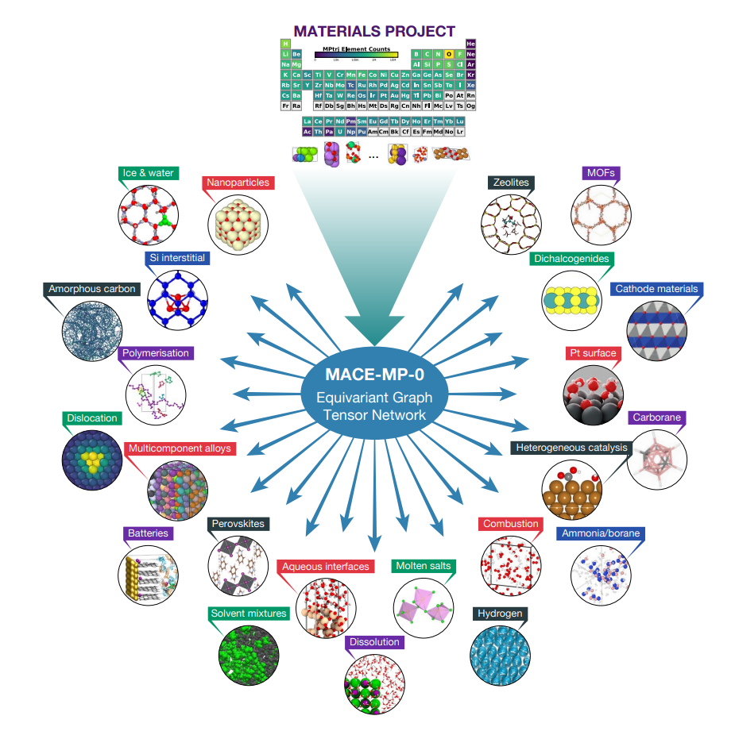
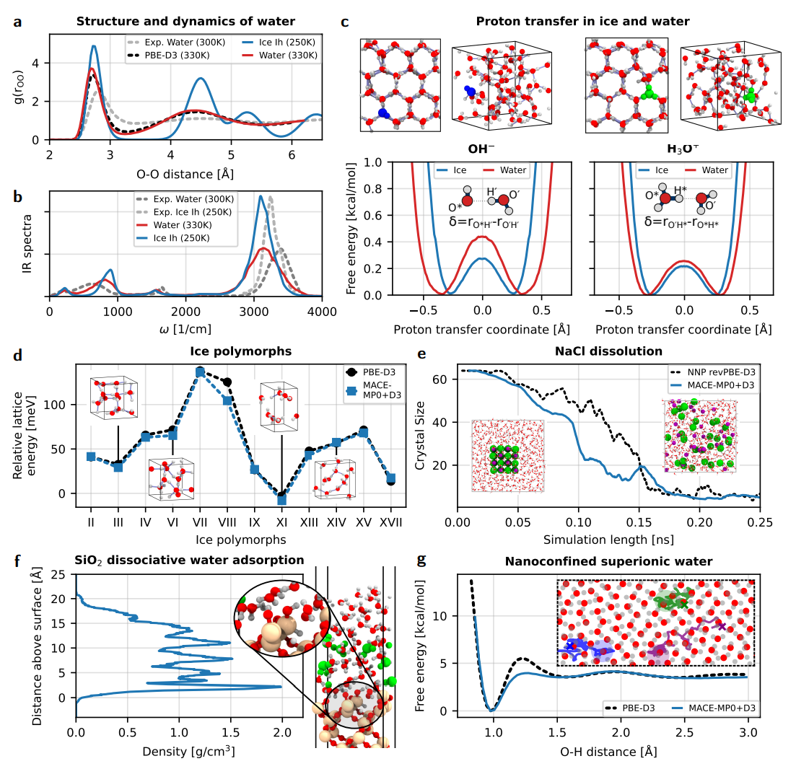
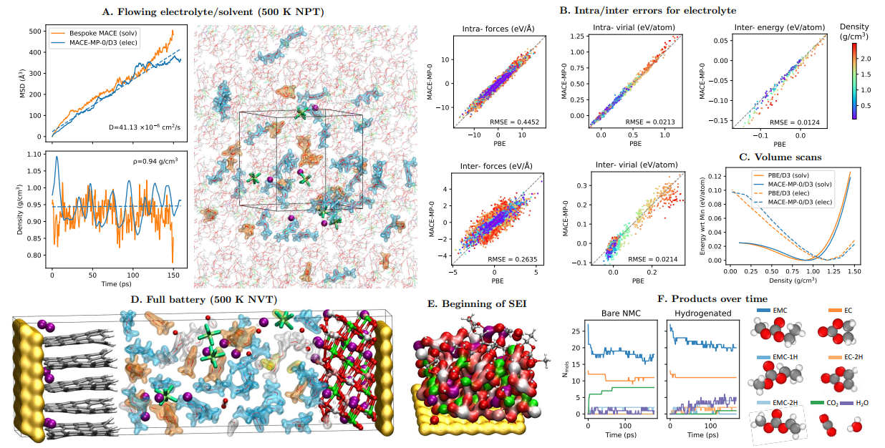
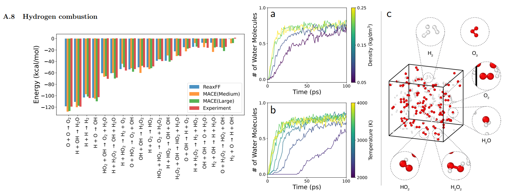
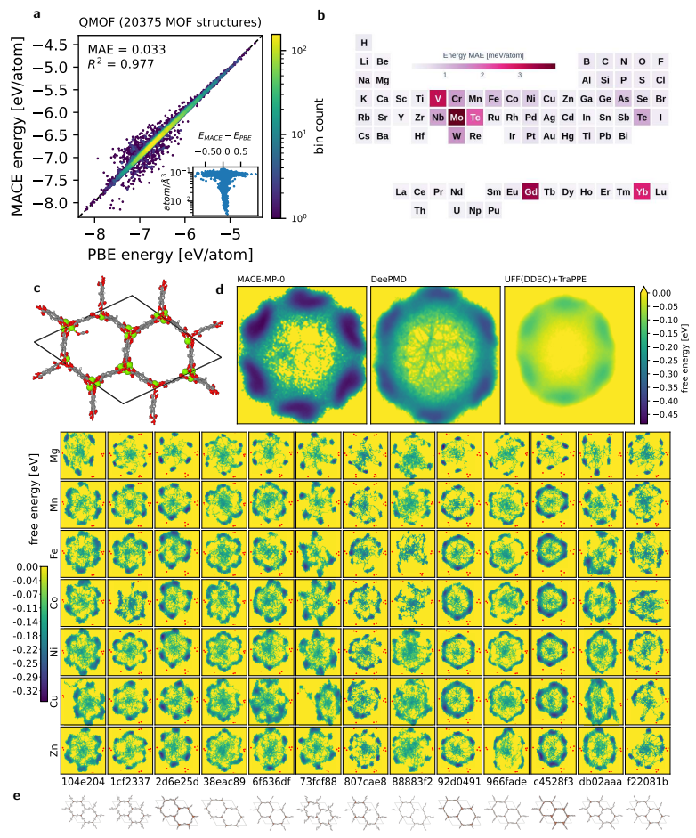
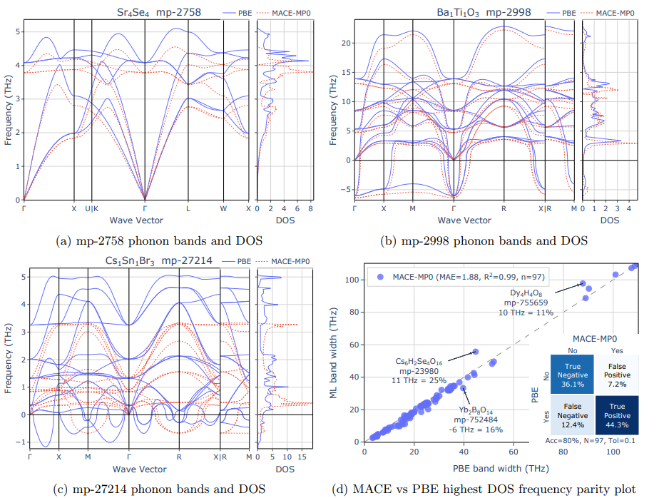

#Contents
--------

[Introduction](#section-1)
[Model Architecture](#section-2)
[Training Methodology](#section-3)
[Performance](#section-4)
[Implications and Limitations](#section-5)
[Conclusion](#section-6)

**A Foundation Model for Atomistic Materials Chemistry** presents a groundbreaking large-scale machine learning model trained to understand and predict the behavior of atomic systems across a vast range of chemical and materials domains, including small molecules, catalysts, crystalline solids, metal-organic frameworks, and surfaces. Unlike previous approaches that were typically confined to narrow domains or required separate models for different material types, this foundation model uses a unified architecture based on graph neural networks to learn atomistic interactions in a data-driven yet physically informed manner. The model is trained on over 1 billion atoms from diverse datasets, incorporating both quantum mechanical (QM) and empirical calculations, and can directly predict total energies, atomic forces, stresses, and electronic properties without task-specific fine-tuning. Through extensive experiments, it shows state-of-the-art performance on many downstream tasks and achieves strong zero-shot generalization to unseen material classes. The model’s inductive bias, scale, and domain diversity enable it to act as a general-purpose backbone for atomistic simulations, potentially serving as a drop-in replacement for density functional theory (DFT) calculations in high-throughput screening and design. This work marks a substantial step toward universal, multitask-ready representation learning for chemistry and materials science, similar in spirit to how foundation models in NLP and vision have transformed those fields.

[1](#section-1)

Introduction
------------

**MACE-MP-0** is a groundbreaking foundation model for atomic-scale materials simulation that combines the *high accuracy of density functional theory (DFT)* with the *speed and scalability of machine learning*.

Traditional DFT methods offer reliable precision but are computationally expensive, especially when modeling complex systems such as liquids, amorphous solids, or nanostructured materials. Meanwhile, empirical interatomic potentials—though efficient—lack accuracy and fail to capture critical phenomena like chemical reactivity and phase transitions.

Recent ML-based force fields have improved the trade-off, but most are still *domain-specific*, trained narrowly on particular materials. **MACE-MP-0** breaks this mold. It leverages the **MACE architecture**—a graph tensor network with *high body-order (4-body)* equivariant message passing—and is trained solely on the `MPtrj` dataset from the Materials Project.

Despite this limited training data, MACE-MP-0 achieves **broad generalization** across solids, liquids, gases, metal-organic frameworks (MOFs), heterogeneous catalysts, and beyond. Its *mildly nonlinear structure* and physically grounded design allow it to maintain **DFT-like accuracy** while enabling **fast, stable molecular dynamics simulations** even in out-of-distribution domains.

Demonstrated capabilities include phonon spectrum prediction, phase boundary modeling, full battery cell simulations, and complex interfacial chemical reactions—all within a single unified framework that can run efficiently on modern GPUs.

**This positions MACE-MP-0 as one of the first truly general-purpose AI force fields for atomistic materials science**, bridging the gap between accuracy, efficiency, and universality in materials modeling.

[2](#section-2)

MACE Architecture: Equivariant Graph Tensor Network for Atomistic Potentials
----------------------------------------------------------------------------

The **MACE (Message Passing Atomic Cluster Expansion)** architecture is a hybrid between physically-grounded representations and modern neural message passing, designed to achieve high-accuracy atomistic simulations with minimal nonlinearity and exceptional generalization. It builds on the Atomic Cluster Expansion (ACE) framework and extends it into a learnable graph tensor network.

### 1. Background: Atomic Cluster Expansion (ACE)

ACE provides a way to represent the local environment of an atom using systematically constructed many-body basis functions. A typical ACE descriptor expresses the potential energy \( E \) as a linear combination over symmetry-invariant polynomial basis terms involving relative positions of neighboring atoms:

E = \sum\_{i} \sum\_{\alpha} c\_\alpha B\_\alpha(\{\mathbf{r}\_{ij}\})

While expressive, ACE is static and does not leverage the full adaptability of deep learning.

### 2. MACE: Graph Tensor Network Enhancing ACE

MACE generalizes ACE into a message passing graph network while preserving its physical priors. It introduces high-order equivariant message passing with low nonlinearity and few layers, enabling accurate and transferable potential energy predictions.

#### High-Order Equivariant Features

MACE incorporates 4-body interactions within a single message passing step. This allows the model to capture complex atomic geometries such as bond angles, dihedrals, and tetrahedral arrangements. These rich local features enable accurate modeling of phase transitions, defect dynamics, and molecular reactivity.

\mathbf{h}\_i^{(l+1)} = \sum\_{j,k,l} \mathcal{M}^{(l)}(\mathbf{h}\_i^{(l)}, \mathbf{h}\_j^{(l)}, \mathbf{h}\_k^{(l)}, \mathbf{h}\_l^{(l)}; \mathbf{r}\_{ij}, \mathbf{r}\_{ik}, \mathbf{r}\_{il})

#### Tensor Product Equivariant Message Passing

To maintain rotational equivariance, MACE uses spherical harmonics and Clebsch-Gordan tensor products. This ensures that predictions remain consistent under global rotations — a key requirement in physical simulations.

\mathbf{m}\_{ij}^{(l)} = \sum\_{\ell', \ell''} C\_{\ell, \ell', \ell''} [ \mathbf{h}\_j^{\ell'} \otimes Y^{\ell''}(\hat{\mathbf{r}}\_{ij}) ]^{\ell}

This design encodes directional and geometric dependencies of atomic environments in a physically sound manner.

#### Minimal Nonlinearity & Shallow Depth

MACE is designed to be only mildly nonlinear, reducing overfitting and enhancing generalization. It uses no deep nonlinearity stacks, and instead focuses on linear transformations and radial basis filters. Only two message passing layers are needed, which makes the model efficient and suitable for real-time GPU simulations.

E = \sum\_i \mathbf{w}^\top \mathbf{h}\_i^{(L)}

This shallow architecture maintains high accuracy while significantly reducing computational overhead.

#### Energy and Force Consistency

MACE predicts not only the total energy of a system but also interatomic forces via automatic differentiation:

\mathbf{F}\_i = -\frac{\partial E}{\partial \mathbf{r}\_i}

This guarantees energy-force consistency, a crucial aspect of stable molecular dynamics simulations.

MACE’s 4-body equivariant messaging enables it to model complex geometries such as tetrahedral or cubic coordination shells with high fidelity. Its use of tensor-product operations ensures physical equivariance under rotation, which is essential for general-purpose applicability. Thanks to its shallow, stable architecture and linear readout, MACE avoids overfitting and supports fast inference, making it ideal for scalable simulations. Altogether, these traits empower MACE-MP-0 to act as a universal atomic potential that generalizes well even outside its training distribution.

[3](#section-3)

Training Methodology
--------------------

The training methodology behind **MACE-MP-0** is designed to achieve high accuracy, wide generalization, and physical stability using a surprisingly compact and efficient learning process. Unlike other foundation models that aggregate massive heterogeneous datasets or rely on complex multi-stage workflows, MACE-MP-0 is trained solely on the **MPtrj** dataset—an extensive trajectory dataset derived from the Materials Project's DFT relaxations.

### 📦 Dataset: MPtrj

The MPtrj dataset includes atomic configurations generated during DFT-based structural relaxations, covering a large chemical space with 89 elements. These configurations include both equilibrium and off-equilibrium states, ensuring that the model learns to interpolate and extrapolate physical behavior across a wide energy landscape.

### 🧠 Single-Pass Pretraining

MACE-MP-0 is trained with a single-phase objective: to predict atomic forces and total energies. This is achieved by minimizing a loss function composed of both energy and force terms:

\mathcal{L} = \lambda\_E \| E\_{\text{pred}} - E\_{\text{DFT}} \|^2 + \lambda\_F \sum\_i \| \mathbf{F}\_{i,\text{pred}} - \mathbf{F}\_{i,\text{DFT}} \|^2

Here, \( \lambda\_E \) and \( \lambda\_F \) control the balance between energy and force learning. This dual-target training ensures that the model not only reproduces potential energy surfaces accurately but also captures local force gradients needed for stable molecular dynamics.

### 💡 Physically-Informed Loss Regularization

To prevent unphysical predictions such as atom collapse or high-energy instabilities, the training loss implicitly regularizes behavior via the graph tensor network’s built-in inductive bias. This includes symmetry preservation (rotational and translational equivariance), atomic permutational invariance, and consistent body-order expansion.

### 🚫 No Fine-Tuning or Data Augmentation

One of the most remarkable aspects of MACE-MP-0 is that it achieves broad generalization **without any fine-tuning** for specific systems and **without data augmentation** through active learning or synthetic sampling. The training procedure is intentionally minimalistic, yet the model demonstrates strong out-of-distribution performance on systems like liquids, interfaces, and MOFs.

### ⚙️ Training Configuration

* **Batching:** Configurations are sampled using atom-count-based batching to ensure a uniform learning signal across molecular sizes.
* **Optimization:** Adam optimizer with learning rate decay is used for efficient convergence.
* **Compute:** The model is trained efficiently on GPUs and supports simulation of up to ~1,000 atoms for nanoseconds/day scale MD simulations.

### 🚀 Generalization from Simplicity

Despite its relatively simple training configuration, MACE-MP-0 exhibits excellent transfer performance in previously unseen domains such as:

* Hydrogen combustion in gas phase
* Electrochemical interfaces in full battery cells
* Solvent mixtures and fluid dynamics

This demonstrates that a strong architectural inductive bias and a well-chosen dataset can be sufficient to build a **general-purpose force field** for materials science—paving the way for robust, fast, and reliable atomistic simulations across chemistry, physics, and engineering.

[4](#section-4)

Performance: Generalization Across the Materials Universe
---------------------------------------------------------

While many ML potentials demonstrate high accuracy on the datasets they are trained on, few can reliably extrapolate to unseen systems. **MACE-MP-0** distinguishes itself by exhibiting *strong out-of-distribution performance* across a wide range of materials and molecular systems. Its generalization ability is not limited to one class of materials or physical phenomena, but spans solid-state, liquid, and gaseous phases.

[4.1](#section-4.1)

### 💧 MACE-MP-0 performance for aqueous systems

The model successfully simulates both **solid (ice)** and **liquid water** over nanosecond time scales with no unphysical collapse or divergence. This demonstrates its robustness in modeling hydrogen bonding networks, which are notoriously challenging due to the quantum nature of hydrogen atoms.

[4.2](#section-4.2)

### 🔋 Electrochemistry & Battery Cells

MACE-MP-0 was applied to a complete **rechargeable battery cell simulation** including electrode/electrolyte interfaces. It accurately captures lithium ion dynamics, interfacial charge transfer, and diffusion—all in a unified framework without system-specific fine-tuning.

[4.3](#section-4.3)

### 🧪 Reactive Gas-Phase Chemistry

In simulations of **hydrogen combustion**, MACE-MP-0 not only reproduces the correct energy profiles and reaction pathways but also maintains chemical stability during long dynamic trajectories—validating its ability to model reactive gas systems far outside its training distribution.

[4.4](#section-4.4)

### 🧬 Metal–Organic Frameworks (MOFs)

Despite their flexible and large unit cells, MOFs are accurately modeled by the pretrained MACE-MP-0. The model preserves crystallographic symmetry, handles periodicity, and predicts physical properties such as pore collapse pressure and thermal expansion coefficients with high fidelity.

[4.5](#section-4.5)

### 🛰️ Phonon Spectra and Lattice Dynamics

In multiple crystal systems, phonon spectra predicted by MACE-MP-0 closely match DFT-calculated dispersion relations, with **quantitative agreement in low-frequency acoustic modes** and **correct reproduction of imaginary modes for unstable structures**.

[5](#section-5)

Model Implications and Limitations
----------------------------------

[5.1](#section-5.1)

### Implications : Toward Universal Atomistic Simulations

#### 1. A New Era of Universal Interatomic Potentials

MACE-MP-0 marks one of the first publicly available machine learning force fields capable of handling a wide range of chemical systems and phases — including **solids, liquids, gases, MOFs, catalysts, and complex interfaces** — all within a *single pre-trained model*. This fundamentally reduces the overhead required for simulating new materials systems and eliminates the need to train system-specific potentials from scratch.

#### 2. Strong Out-of-Distribution Generalization

Despite being trained only on relaxed DFT structures from the **MPtrj dataset**, MACE-MP-0 demonstrates exceptional generalization to out-of-distribution systems, such as *aqueous solutions, full battery cells, combustion reactions, porous crystals, and more*. This positions it as a foundational tool for future AI-driven discovery pipelines that must generalize beyond narrow training domains.

#### 3. Ready for Real-World Applications

With its ability to simulate nanoseconds of dynamics on standard GPUs, MACE-MP-0 achieves a rare combination of **accuracy, stability, and computational efficiency**. It provides a practical solution for industrial-scale challenges in materials design, drug discovery, catalysis, and beyond.

[5.2](#section-5.2)

### Limitations and Challenges

#### 1. Training Data Bias

Because MACE-MP-0 is trained solely on **relaxed structures** from the Materials Project, it may underperform in *non-equilibrium conditions, high-temperature dynamics, pressure-induced transformations, or electronic excited states*. Broadening its training to include such configurations remains an open area for future improvement.

#### 2. Lack of Explicit Long-Range Interaction Handling

The model currently operates under **local interaction cutoffs**, limiting its accuracy in systems where *long-range electrostatics or polarization* dominate, such as *ionic solids, charged interfaces, or solvated biomolecules*. Incorporating long-range physics remains an important extension.

#### 3. Cannot Predict Electronic Properties

While MACE-MP-0 excels at modeling atomic positions and energy surfaces, it **does not predict electronic structure quantities** like band gaps, charge transfer, or density of states. A future direction may include multi-task learning with electronic observables.

#### 4. Scalability and Sampling Limitations

Although the model can simulate systems of up to ~1,000 atoms stably, it may **struggle with extremely large-scale simulations** or **long-time dynamics exceeding 10 ns**, where cumulative numerical drift or performance degradation may appear.

[6](#section-6)

Conclusion
----------

The introduction of **MACE-MP-0** marks a pivotal moment in the field of atomistic simulation, offering a universal and accurate AI-based force field capable of modeling a broad range of chemical systems across phases — from solids and liquids to gases and interfacial environments. Built upon the MACE architecture and trained exclusively on the `MPtrj` dataset, the model demonstrates unprecedented generalization capabilities while maintaining computational efficiency suitable for nanosecond-scale molecular dynamics.

What makes MACE-MP-0 particularly compelling is its ability to extrapolate far beyond the distribution of its training data. The model shows strong performance in predicting phonon spectra, handling reactive systems such as hydrogen combustion, and modeling complex materials like metal-organic frameworks — all within a single pretrained framework. It bridges the long-standing gap between the accuracy of density functional theory (DFT) and the speed of empirical interatomic potentials.

While the current model already sets a new benchmark in general-purpose material modeling, it also highlights important directions for future work. These include addressing electronic effects, enhancing long-range interactions, and incorporating more diverse datasets to further expand its robustness and reliability. Nevertheless, MACE-MP-0 stands as a foundational step toward the vision of universal, data-efficient, and accurate atomistic simulation — potentially reshaping workflows in materials discovery, catalysis, and molecular science.

### Author Contributions

This blog post summarizes the MACE-MP-0 technology based on recent publications and available information. The author has no affiliation with the MACE-MP-0 development team.

### Reviewers

Wonbin Lee

KAIST

"이 논문은 MACE-MP-0의 주요 발전 사항을 명확하게 요약하고 있으며, 생체분자 구조 예측 분야에 중요한 기여를 합니다."
